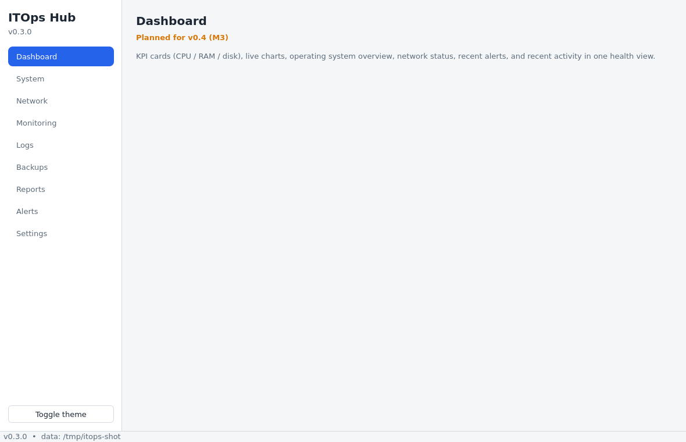
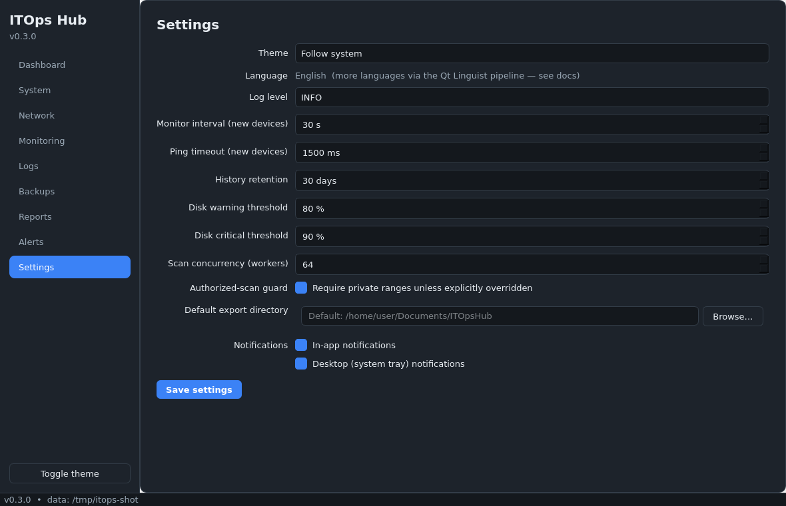

# ITOps Hub

**Modular desktop IT operations platform** — system diagnostics, network
discovery, connectivity monitoring, log analysis, disk monitoring, backup
operations, reporting, and automation in a single modern desktop application.


> **Current state: v0.3 (M2 — Core Setup).** The architecture, database,
> settings, audit logging, theming, and application shell are real and
> tested (79 automated tests). Feature modules land milestone by milestone —
> see [Project Roadmap](#project-roadmap). Pages not yet implemented are
> labeled in-app with the exact version where they arrive; there are no mock
> features.

## Overview

ITOps Hub gives IT administrators one offline-first Windows desktop tool for
day-to-day operations: checking system health, scanning networks they own,
monitoring device connectivity, watching disk usage, analyzing logs,
creating safe local backups, and exporting reports. It is built to later
grow into a web and multi-device platform (v2.x) without rewriting its core.

## Problem

Everyday IT operations work is scattered across CLIs, one-off scripts,
browser tabs, and disposable tools. ITOps Hub consolidates the common local
workflow — diagnose, discover, monitor, analyze, back up, report — behind a
consistent, tested, offline-capable desktop interface with a persistent
local history and an auditable activity trail.

## Features

| Module | What it does | Status |
|---|---|---|
| Dashboard | KPI cards, live charts, health summary, recent alerts/activity | v0.4 (M3) |
| System | Hostname, OS, CPU, RAM, storage, adapters, IPs, uptime | v0.4 (M3) |
| Network | Authorized CIDR scanning with progress, cancel, export | v0.5 (M4) |
| Monitoring | Ping monitors with states, latency history, alerts | v0.6 (M5) |
| Disk | Drive usage with configurable warning/critical thresholds | v0.6 (M5) |
| Logs | Pluggable log parsing, level counts, anomalies | v0.7 (M6) |
| Reports | CSV / JSON / TXT exports with metadata | v0.8 (M7) |
| Backups | Verified local backups, non-destructive by design | v1.2 (M9) |
| Local API | FastAPI service (localhost, token auth, OpenAPI) | v1.5 (M10) |
| Settings | Themes, thresholds, intervals, retention, export dir | **v0.3 ✅** |
| Activity log | Audit trail of application actions | **v0.3 ✅** |

## Screenshots

| Shell (light) | Settings (dark) |
|---|---|
|  |  |

Real offscreen captures of the running application (v0.3).

## Architecture

Layered, Qt-free core; UI and (later) FastAPI share one service layer:

```
Desktop UI (PySide6)          FastAPI (v1.5, localhost)
        └──────────┬────────────────┘
           Application layer (container, use cases)
                   Service layer (business logic)
                   Domain (entities, validation, Protocols)
                   Infrastructure (SQLite, OS, files, logging)
```

Details and rules: [docs/architecture.md](docs/architecture.md) ·
Decisions: [docs/decisions.md](docs/decisions.md)

## Technology Stack

- **Python 3.11+** (3.12/3.13 in CI) · **PySide6** for the desktop UI
- **SQLAlchemy 2.0 + Alembic** over **SQLite** (WAL) — PostgreSQL-ready
- **Pydantic v2** for settings and (later) API schemas
- **PyQtGraph** for live charts (lands v0.4)
- **FastAPI + uvicorn** for the local API (v1.5, opt-in, loopback-only)
- **psutil** for system metrics; system `ping` subprocess for reachability
- **pytest / pytest-qt / httpx** for testing; **ruff + mypy strict** for quality
- **PyInstaller** (+ GitHub Actions `windows-latest`) for packaging

## Installation

**Prerequisites:** Python 3.11+ (3.12/3.13 recommended) and Git.

```bash
git clone <repository-url>
cd itops-hub
python -m venv .venv
# Windows:
.venv\Scripts\activate
# Linux/macOS:
source .venv/bin/activate
pip install -r requirements.txt -r requirements-dev.txt
```

(Or run `scripts/run_dev.sh` on Linux/macOS, which does all of the above.)

## Running the Application

```bash
python -m app.main              # desktop application
python -m app.main --version    # print version
python -m app.main --selftest   # headless core verification (no GUI)
```

First launch creates the runtime data directory automatically:
- Windows: `%LOCALAPPDATA%\ITOpsHub` (database + logs)
- Linux/macOS: XDG data dir (`~/.local/share/ITOpsHub`)
- Override for development via `ITOPS_HUB_DATA_DIR` (see `.env.example`)

## Configuration

All configuration lives in the local SQLite settings store and is edited in
the in-app **Settings** page (theme, log level, monitoring defaults, disk
thresholds, retention, export directory, notification preferences, scanner
options). No secrets are used or stored anywhere; `.env.example` documents
the single development override (`ITOPS_HUB_DATA_DIR`).

## Modules

See the [Features](#features) table above and the in-app sidebar (Dashboard,
System, Network, Monitoring, Logs, Backups, Reports, Alerts, Settings).
Unimplemented pages state the milestone in which they arrive.

## API

The local FastAPI service ships in **v1.5 (M10)**: localhost-only, opt-in,
token-guarded, with OpenAPI docs at `/docs`. The service layer it will share
with the UI is already in place — see `docs/architecture.md`.

## Testing

```bash
pytest                 # full suite (UI tests run offscreen)
pytest -m "not ui"     # skip Qt tests
pytest tests/unit      # layer-specific runs: tests/integration, tests/ui
```

Quality gates (all must pass, enforced in CI):

```bash
ruff format --check .
ruff check .
mypy                    # strict, over domain/services/application
python -m app.main --selftest
```

## Build & Release

The Windows build runs on GitHub Actions (`build-windows.yml`) on
`windows-latest`:

```bash
pip install -r requirements.txt -r requirements-dev.txt
pyinstaller itopshub.spec --noconfirm     # -> dist/ITOpsHub/ITOpsHub.exe
dist/ITOpsHub/ITOpsHub.exe --selftest     # packaged smoke test
```

An Inno Setup installer (`ITOpsHub-Setup.exe`) is added at the v1.0/v1.5
packaging milestones. Details: `docs/deployment.md` (added at v1.0).

## Security

- Security by design: validated inputs, no `shell=True`, bounded subprocess
  timeouts, path validation, authorization guard on network scanning.
- Credentials are sanitized out of all logs (defense-in-depth); no secrets
  exist in the application or repository (CI secret scanning enabled).
- Local-only by default: no telemetry, no cloud upload, loopback-only API.
- See `docs/security.md` (published at v1.5 security review).

## Project Roadmap

| Version | Scope |
|---|---|
| v0.1–v0.2 | Planning & architecture ✅ |
| v0.3 | Core setup: repo, CI, DB, settings, theming, shell ✅ |
| v0.4 | System module + Dashboard (charts) |
| v0.5 | Network scanner |
| v0.6 | Monitoring + Disk + Alerts |
| v0.7 | Log analyzer |
| v0.8 | Reports |
| v1.0 | Desktop MVP (packaged, hardened) |
| v1.1–v1.3 | Monitoring improvements, backups, scheduling |
| v1.4–v1.5 | Hardening + stable local API release |
| v2.x+ | Web dashboard, remote monitoring, PostgreSQL, teams (out of scope now) |

## Known Limitations

- Feature modules beyond Settings are not implemented yet (v0.3); in-app
  placeholder pages state exactly what lands when.
- The Windows build workflow has not yet executed (it runs once the repo is
  pushed to GitHub — decision AD-002).
- Reachability checks use the system `ping` (no admin rights required);
  ICMP-filtered hosts need the TCP probe (v0.5) and MAC discovery is
  best-effort via the ARP cache (decision AD-009).
- Packaged executables are unsigned (zero-cost budget); Windows SmartScreen
  will warn on first run.

## Future Improvements

Arabic (and other) localizations via the Qt Linguist pipeline; PDF reports;
code signing; PostgreSQL backend; web dashboard and multi-device agents
(v2.x roadmap).

## License

[MIT](LICENSE) — Copyright (c) 2026 ITOps Hub Contributors.
