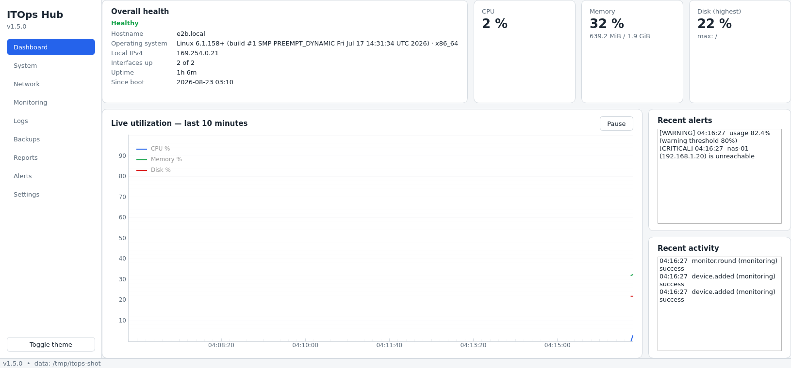
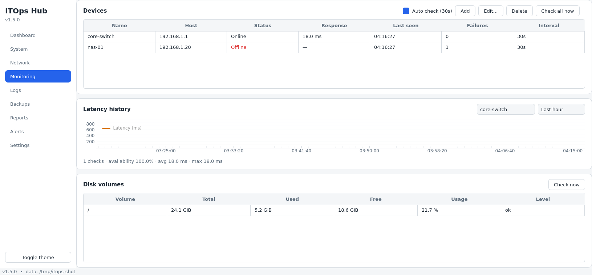
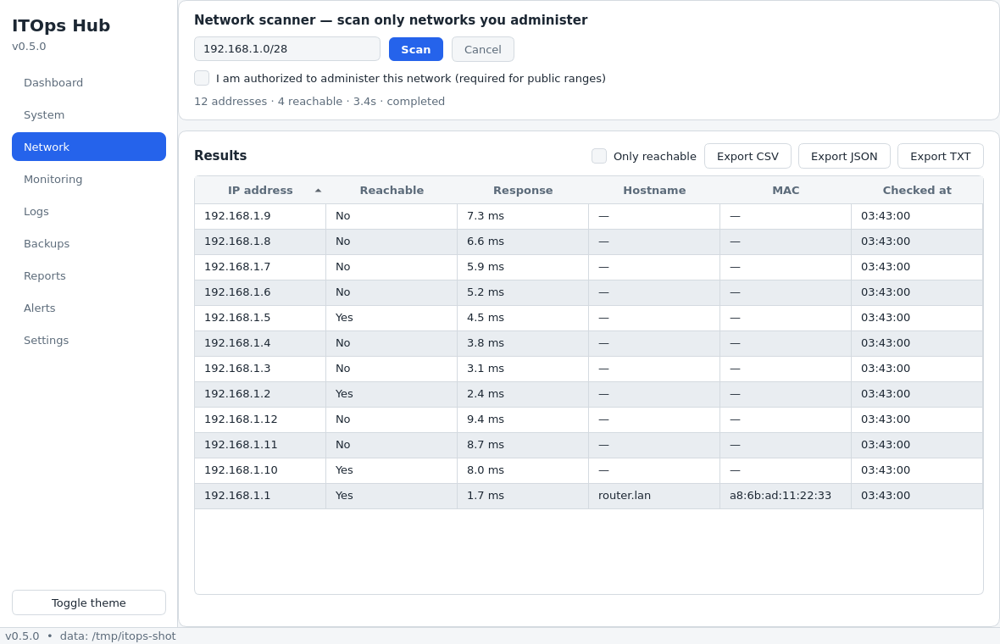
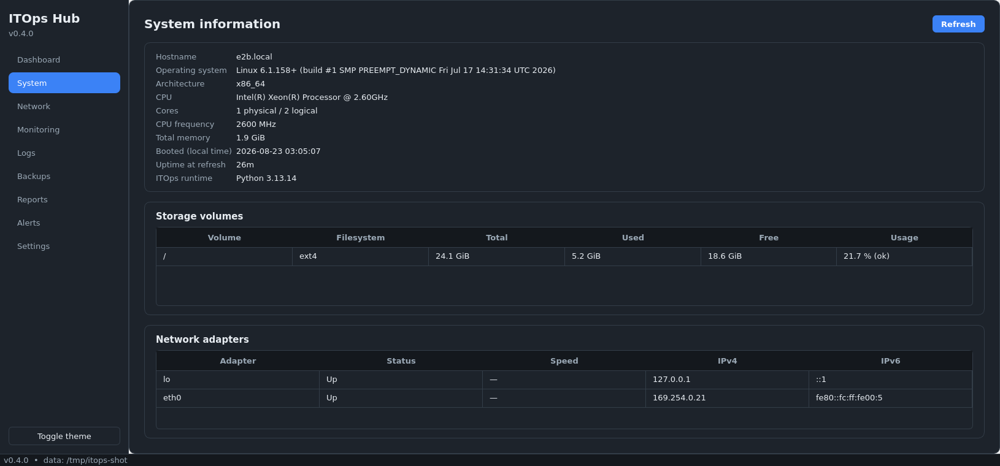
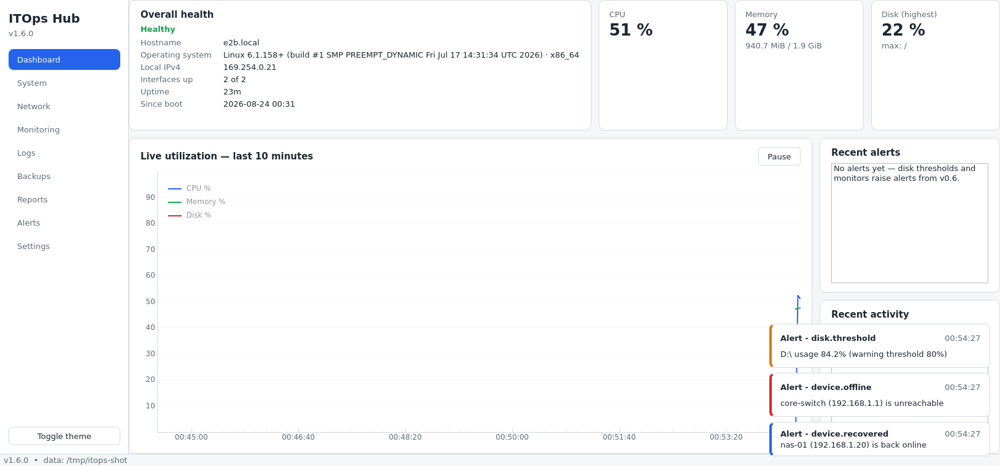

# ITOps Hub

**Modular desktop IT operations platform** — system diagnostics, network
discovery, connectivity monitoring, log analysis, disk monitoring, backup
operations, reporting, scheduling, and a local API in a single modern
desktop application.


> **Current state: v1.5 — Stable Local API Release.** All nine modules are
> real and tested: Dashboard, System, Network scanner, Monitoring, Logs,
> Backups, Reports, Alerts, Settings — plus a loopback-only FastAPI service
> sharing the exact same core. 282 automated tests; no mock features; every
> page that says it does something actually does it.

## Overview

ITOps Hub gives IT administrators one offline-first Windows desktop tool for
day-to-day operations: checking system health, scanning networks they own,
monitoring device connectivity, watching disk usage, analyzing logs,
creating safe local backups, and exporting reports. The layered,
service-oriented core is built to grow into a web and multi-device platform
(v2.x) without rewriting the application.

## Problem

Everyday IT operations work is scattered across CLIs, one-off scripts,
browser tabs, and disposable tools. ITOps Hub consolidates the common local
workflow — diagnose, discover, monitor, analyze, back up, report — behind a
consistent, tested, offline-capable desktop interface with persistent local
history, an alert lifecycle, scheduled jobs, and an auditable activity
trail.

## Features

| Module | What it does | Status |
|---|---|---|
| Dashboard | KPI cards, live CPU/RAM/disk chart, health summary, alerts & activity feeds | ✅ |
| System | Hostname, OS, CPU, RAM, storage volumes, adapters, IPs, uptime | ✅ |
| Network | Authorized CIDR scanning: concurrent checks, progress, cancel, hostname + ARP MAC, export | ✅ |
| Monitoring | Device CRUD, online/offline/warning states, latency history, auto-checks, scheduler | ✅ |
| Disk | Per-volume usage, configurable warn/crit thresholds, alert lifecycle | ✅ |
| Logs | Auto-detected parsers (Python logging / syslog / generic), level counts, top errors, anomaly flags | ✅ |
| Backups | Timestamped copies, manifest verification, cancel-safe, schedulable profiles | ✅ |
| Reports | Six datasets → CSV/JSON/**TXT/PDF** with metadata; never overwrites | ✅ |
| Alerts | Deduplicated raise/resolve, acknowledge, filters | ✅ |
| Notifications | In-app toasts + system-tray messages for raised alerts | ✅ |
| Local API | Loopback FastAPI + OpenAPI, per-session token, same core services | ✅ |
| Settings | Themes, thresholds, retention, scanner limits, API, backup profiles, import/export | ✅ |

## Screenshots

| Dashboard — live data | Monitoring — devices & disks |
|---|---|
|  |  |

| Network scanner | System inventory |
|---|---|
|  |  |

| Alert toasts (v1.6) |
|---|
|  |

Real captures of the running application (offscreen renders with live
psutil data and seeded demo devices at capture time — no fake widgets).

## Architecture

Layered, Qt-free core; UI and FastAPI share one service layer — no
duplicated business logic:

```
Desktop UI (PySide6)          Local API (FastAPI, loopback)
        └──────────┬────────────────┘
           Application layer (container, scheduler, use cases)
                   Service layer (9 business services)
                   Domain (entities, validation, Protocols)
                   Infrastructure (SQLite WAL, psutil, safe ping, files)
```

Details: [docs/architecture.md](docs/architecture.md) ·
Decisions (19 ADRs): [docs/decisions.md](docs/decisions.md)

## Technology Stack

- **Python 3.11+** (3.12/3.13 in CI) · **PySide6** desktop UI
- **SQLAlchemy 2.0 + Alembic** over **SQLite** (WAL) — PostgreSQL-ready
- **Pydantic v2** (settings + API schemas) · **PyQtGraph** live charts · **reportlab** PDF reports
- **FastAPI + uvicorn** local API · **psutil** metrics
- System `ping` subprocess (list args, `shell=False`, no admin rights)
- **pytest / pytest-qt / httpx** tests · **ruff + mypy strict** quality gates
- **PyInstaller + Inno Setup** packaging (GitHub Actions windows-latest)

## Installation

**Prerequisites:** Python 3.11+ and Git.

```bash
git clone <repository-url>
cd itops-hub
python -m venv .venv
# Windows:      .venv\Scripts\activate
# Linux/macOS:  source .venv/bin/activate
pip install -r requirements.txt -r requirements-dev.txt
```

(Or `scripts/run_dev.sh` on Linux/macOS.)

## Running the Application

```bash
python -m app.main              # desktop application
python -m app.api               # standalone local API (loopback)
python -m app.main --version    # print version
python -m app.main --selftest   # headless core verification (CI/packaged)
```

First launch creates `%LOCALAPPDATA%\ITOpsHub` (database + logs); exports
default to `Documents\ITOpsHub`. Override for development with
`ITOPS_HUB_DATA_DIR` (see `.env.example`).

## Configuration

All configuration is edited in the in-app **Settings** page and stored as a
validated JSON document in SQLite: theme, log level, monitoring defaults,
snapshot interval, disk thresholds, retention, scan limits, export folder,
notifications, local API, and backup profiles. Settings export/import as
JSON for machine transfers. No secrets exist anywhere in the app.

## Modules

See the [Features](#features) table; each module has a user-facing guide in
[docs/user-guide.md](docs/user-guide.md).

## API

Opt-in local FastAPI service (Settings → Local API, or `python -m app.api`):
loopback-only, per-session token auth, OpenAPI docs at `/docs`, every
endpoint group tested. Full reference: [docs/api.md](docs/api.md).

## Testing

```bash
pytest                          # 282 tests (unit / integration / UI / API)
pytest --ignore=tests/ui        # headless run (UI modules not collected)
ruff format --check . && ruff check .   # lint gates
mypy                            # strict types over the core layers
```

`pytest -m "not ui"` also works but still *collects* the UI modules (they
import PySide6) — prefer `--ignore=tests/ui` on headless machines.

Strategy and suite map: [docs/testing.md](docs/testing.md).

## Build & Release

```powershell
pyinstaller itopshub.spec --noconfirm   # -> dist\ITOpsHub\ITOpsHub.exe
iscc scripts\installer.iss              # -> dist\ITOpsHub-Setup.exe
```

CI builds both on `windows-latest` for every `v*` tag and runs the packaged
selftest. Full procedure: [docs/deployment.md](docs/deployment.md).

## Security

- Validated inputs everywhere; subprocess with argument lists, never
  `shell=True`; path safety rules for backups/exports
- Authorization guard on network scanning; scan size caps
- Loopback-only API with per-session tokens + confirmation semantics
- Sanitized logging & audit trail; no credentials by design; no telemetry
- Full review record: [docs/security.md](docs/security.md)

## Project Roadmap

| Version | Scope | |
|---|---|---|
| v0.1–v0.2 | Planning & architecture | ✅ |
| v0.3 | Core setup: repo, CI, DB, settings, theming, shell | ✅ |
| v0.4 | System module + Dashboard (live charts, snapshots, retention) | ✅ |
| v0.5 | Network scanner + export service | ✅ |
| v0.6 | Monitoring + disk alerts + alert lifecycle | ✅ |
| v0.7 | Log analyzer (pluggable parsers, anomalies) | ✅ |
| v0.8 | Reports (six datasets) | ✅ |
| v1.0–v1.1 | MVP hardening, monitoring improvements | ✅ |
| v1.2–v1.3 | Backup manager, scheduler, settings portability | ✅ |
| v1.4–v1.5 | Hardening, local API, production packaging, full docs | ✅ |
| v2.x+ | Web dashboard, remote monitoring, PostgreSQL, teams | future |

## Known Limitations

- Executables are unsigned → SmartScreen warns on first run (zero-cost
  budget); documented in deployment.md.
- Screenshots are offscreen captures of the real UI with live data; native
  Windows screenshots are a welcome contribution.
- ICMP reachability uses the system `ping` (no admin rights needed);
  ICMP-filtered hosts appear offline (TCP probe is a roadmap item); MAC via
  ARP cache and hostnames via reverse DNS are best-effort (AD-009).
- Scheduler runs while the desktop app is open (no OS service mode yet).
- none — PDF export shipped in v1.6.

## Future Improvements

Arabic (and other) localizations via the Qt Linguist pipeline; TCP-connect
probe; code signing; PostgreSQL backend; web dashboard and multi-device
agents (v2.x roadmap).

## License

[MIT](LICENSE) — Copyright (c) 2026 ITOps Hub Contributors.
